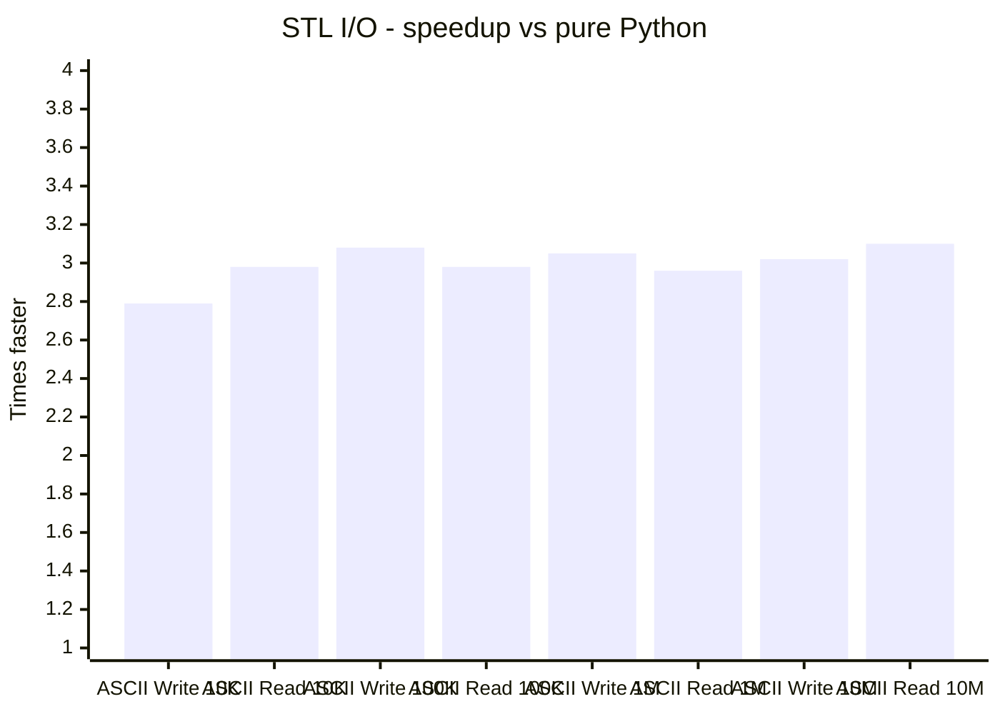
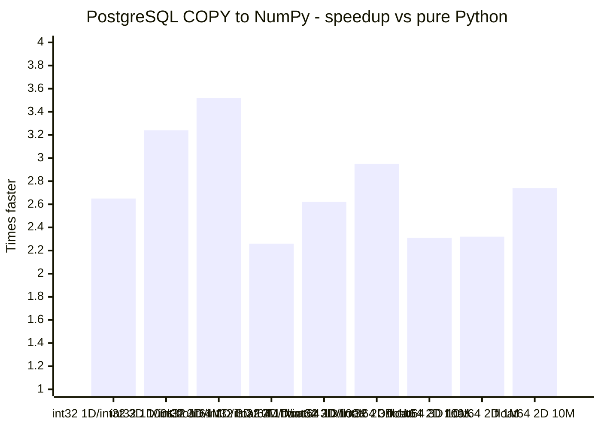

<!-- Generated by run_benchmarks.py - do not edit -->

## STL I/O

```mermaid
xychart-beta
    title "STL I/O - speedup vs pure Python"
    x-axis ["ASCII Write 10K", "ASCII Read 10K", "ASCII Write 100K", "ASCII Read 100K", "ASCII Write 1M", "ASCII Read 1M", "ASCII Write 10M", "ASCII Read 10M"]
    y-axis "Times faster" 1 --> 4
    bar [2.79, 2.98, 3.08, 2.98, 3.05, 2.96, 3.02, 3.10]
```

## PostgreSQL to NumPy

```mermaid
xychart-beta
    title "PostgreSQL COPY to NumPy - speedup vs pure Python"
    x-axis ["int32 1D/int32 3D 100K", "int32 1D/int32 3D 1M", "int32 1D/int32 3D 10M", "float64 1D/int32 2D/float64 3D 100K", "float64 1D/int32 2D/float64 3D 1M", "float64 1D/int32 2D/float64 3D 10M", "float64 2D 100K", "float64 2D 1M", "float64 2D 10M"]
    y-axis "Times faster" 1 --> 4
    bar [2.65, 3.24, 3.52, 2.26, 2.62, 2.95, 2.31, 2.32, 2.74]
```
